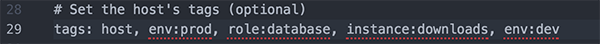
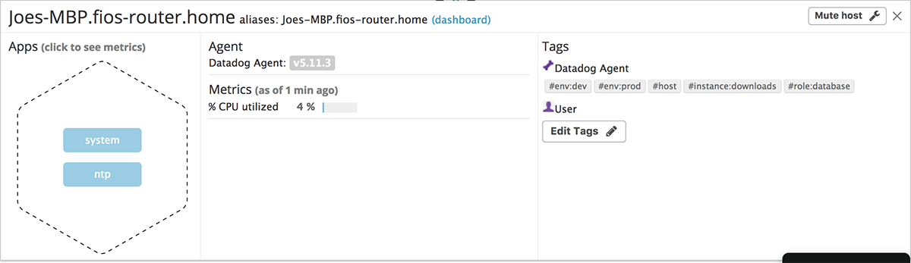

# Getting Started:
* Fork the provided repo to your GitHub
* Clone to your local host
  * `git clone {insert link}`
* Go to file's root directory
* Change branch to provided name
  * `git co -b {First Name}_{Last Name}_Solutions_Engineer`

# Setup the environment:
* Initially I decided to try and complete this assignment on a MacBook Pro. Everything was running smoothly until I got to the very end. I attempted to install the tracer agent onto my mac but was unable to and ran it on the virtual machine. I will include the steps I took for the virtual machine.
* Download Vagrant and install depending on your computer's OS
  * [VAGRANT](https://www.vagrantup.com/downloads.html)
* In the root directory run vagrant
  * `vagrant init hashicorp/precise64`
* Download VirtualBox and install
  * [VirtualBox 5.1](https://www.virtualbox.org/wiki/Download_Old_Builds_5_1)
  * **NOTE**: Vagrant only supports VirtualBox versions 4.0, 4.1, 4.2, 4.3, 5.0, 5.1
* Open VirtualBox software
* On Terminal Run:
  * `vagrant up --provider=virtualbox`
* On VirtualBox
  * Double click "hiring-engineers_default"
    * Login: vagrant
    * Password: vagrant
* After login install curl and Datadog Agent on the VM
  * `sudo apt-get install curl`
  * [Datadog Agent](https://app.datadoghq.com/account/settings#agent/ubuntu)

# Collecting Metrics:
#### Adding tags in VirtualBox
* Location of Datadog config file on VirtualBox
  * `/etc/dd-agent/datadog.conf`
  * use `sudo nano datadog.conf` to edit the file
  * 
  * Restart agent `sudo /etc/init.d/datadog-agent restart`
  * 

#### Adding tags on OSX
* Location of Datadog config file on Mac OSX
  * `~/.datadog-agent/datadog.conf`
* Uncomment tag line, and add tags
  * 
* Restart Datadog Agent via App or terminal line
  * 
  * 
* New tags on Host mapping
  * 

#### Installing and integrating a database/Create a custom Agent check
* My current computer has PostgreSQL install on it
* Check PostgreSQL is sending metrics
   * `/usr/local/bin/datadog-agent info`
    * 
    * 
* Create a custom Agent check that submits a metric named my_metric with a random value between 0 and 1000
  * Create yaml file
  * check's collection interval so that it only submits the metric once every 45 seconds
    * 
  * Create py file
    * 
* Preview of metric
  * 
* **Bonus** Question Can you change the collection interval without modifying the Python check file you created?
 * You add `min_collection_interval: 45` to your yaml file

# Visualizing Data:
* Utilize the Datadog API to create a Timeboard that contains:
  * Your custom metric scoped over your host.
  * Any metric from the Integration on your Database with the anomaly function applied.
  * Your custom metric with the rollup function applied to sum up all the points for the past hour into one bucket
    * 
* Once this is created, access the Dashboard from your Dashboard List in the UI:
  * Set the Timeboard's timeframe to the past 5 minutes
  * Take a snapshot of this graph and use the @ notation to send it to yourself.
    * 
  * Bonus Question: What is the Anomaly graph displaying?
    * Anomaly graphs are showing the trend of the metric being measured and will give distinctive visualization when the data is out of the norm. For example, the traffic of your website during a specific time period.

# Monitoring Data:
  * Create a new Metric Monitor that watches the average of your custom metric (my_metric) and will alert if it’s above the following values over the past 5 minutes:
    * Warning threshold of 500
    * Alerting threshold of 800
    * And also ensure that it will notify you if there is No Data for this query over the past 10m.
    * 
    * Screenshot of the email when I turned off my laptop, since no data is being sent I received an alert
    * 
    * **Bonus Question:** Since this monitor is going to alert pretty often, you don’t want to be alerted when you are out of the office. Set up two scheduled downtimes for this monitor:
      * Under Monitors on the left panel, click on manage downtimes
      * 
      * 

# Collecting APM Data:
* For this part of the challenge I had to use VirtualBox. I had attempted to install the trace agent to my mac but was unable to make it work.
* I had a ntp error so I had to correct that with the follow terminal commands
  * 
* Enable APM on datadog.conf file
  * 
* Install dependencies onto VM
  * ddtrace
  * Flask
  * blinker
* Create flask app in python
  * 
* Run flask app
  * `ddtrace-run python [app_name].py`
* Terminal output
  * 
* Trace graphs
  * 
* **Bonus Question:** What is the difference between a Service and a Resource?
  * A service is a group of processes that run together to make the main/part of the application to run. For an example, Heroku is a service that compiles your application code, along side that it could use a database service like PostgreSQL.
  * A resource is the query of the service. Either the service that does an API call or providing the link to a particular page via routes.

# Final Question:
* Is there anything creative you would use Datadog for?
  * I am currently building a dog walking application and I could see using Datadog to monitor the daily usage of the database. Although I am currently using Firebase, switching to AWS would allow me to do this. If my application ends up growing I could see the efficiency of the database and would be able to test my queries and see if it improves or not. 
